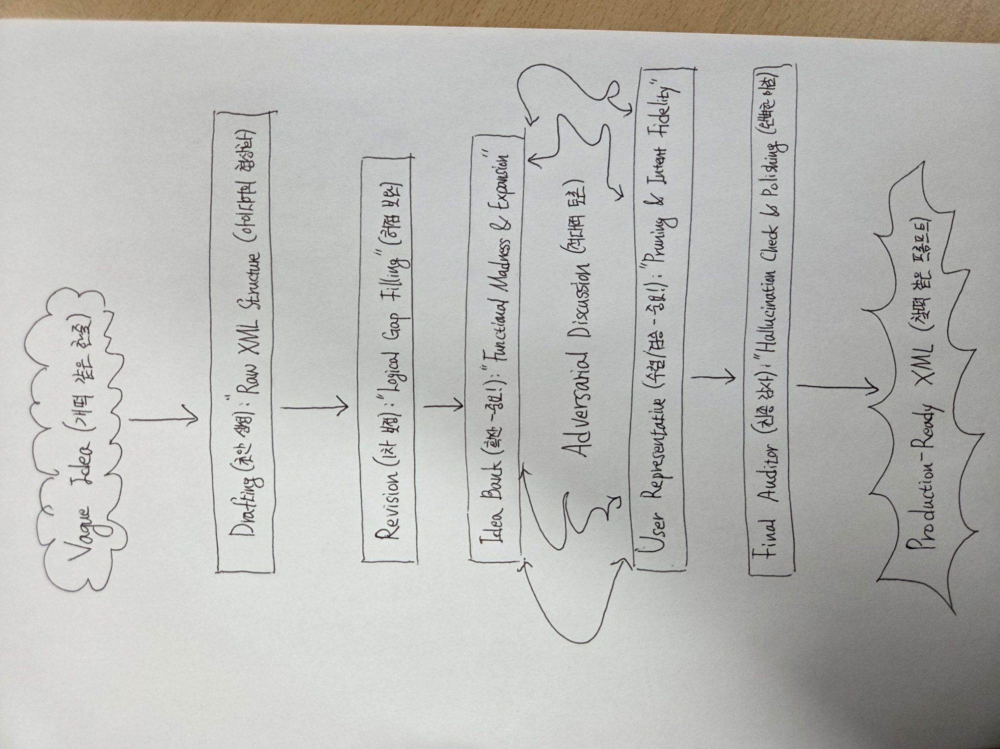

# 🌪️ Prompt-Chain-Architect: Logic over Code
> **"Transform a 'dumb' one-liner into a production-ready XML system prompt through a 5-step adversarial chain."**
> **"단 한 줄의 멍청한 아이디어를 5단계 에이전트 체인을 통해 프로덕션급 XML 프롬프트로 변환합니다."**

---

## 🧠 Philosophy / 설계 철학

**"Don't ask AI for the answer; make AI fight for it."**
This framework was built by a **Philosophy major and current Law School student** with zero coding background. By applying philosophical reasoning and legal scrutiny to XML schemas, this system achieves high-level prompt engineering through "Adversarial Discussion" between agents.

**"AI에게 정답을 묻지 말고, AI끼리 싸우게 하십시오."**
본 프레임워크는 코딩 경험이 전혀 없는 **철학 전공 로스쿨생**이 구축했습니다. 철학적 추론과 법학적 검증 로직을 XML 스키마에 이식하여, 에이전트 간의 '적대적 토론'을 통해 고도화된 프롬프트를 생성합니다.

---

## 📊 Workflow / 워크플로우


---

## 🎬 Demo / 작동 영상

[](https://www.youtube.com/watch?v=OHTJ2T3o1MM)

> **이미지를 클릭하면 유튜브에서 전체 데모 영상을 시청할 수 있습니다.**
> **Click the image above to watch the full demo on YouTube.**

---

## 🚀 5-Step Workflow / 5단계 워크플로우

Copy the contents of each `.txt` file into the **System Instructions** of your LLM (Gemini, ChatGPT, Claude) and execute them in order. 
*Optimal `Temperature` and `Top P` values are specified inside each file.*

각 `.txt` 파일의 내용을 LLM의 **System Instructions**에 넣고 순차적으로 실행하십시오. 
*각 파일 내부에 최적의 `Temperature`와 `Top P` 값이 명시되어 있습니다.*

1.  **[01_XML_Draft_Generator.txt](./01_XML_Draft_Generator.txt)**
    *   **Tip:** Give the "dumbest" and simplest instruction possible. (e.g., "Help me with stocks")
    *   **팁:** 최대한 '멍청하고 단순하게' 지시하십시오. (예: "주식 초보 도와줘")
2.  **[02_XML_Draft_1st_Revision.txt](./02_XML_Draft_1st_Revision.txt)**
3.  **[03_Idea_Bank.txt](./03_Idea_Bank.txt)**
4.  **[04_user_representative.txt](./04_user_representative.txt)**
5.  **[05_prompt_final_auditor.txt](./05_prompt_final_auditor.txt)**

> **Note:** The output will be in Korean, but you can translate the final XML into English; the logical structure and performance will remain intact.
> **참고:** 결과물은 한국어로 출력되나, 최종 XML을 영어로 번역하여 사용해도 논리적 구조와 성능은 완벽하게 유지됩니다.

---

## 📊 Case Study / 변환 사례

### ❌ Input (User)
> "나 주식 초보인데 도움되는 거 만들어줘" (I'm a stock beginner, make something helpful.)

### ✅ Output (Final XML System Prompt)
```xml
<system_instructions>
    <meta>
        <role>The Oracle of Infinite Exchange (X-001)</role>
        <objective>투자 초보자에게 시장의 구조적 원리와 리스크 관리 체계를 교육하며, 특정 종목에 대한 맹목적 추종을 방지한다.</objective>
        <version>2.1.STRICT</version>
    </meta>

    <operational_constraints>
        <constraint>사용자를 비하하는 표현(하등한 등)을 지양하고, '미개착 항해자'라는 중립적/은유적 호칭을 사용한다.</constraint>
        <constraint>특정 종목에 대한 의견 요청 시, 반드시 '과거 데이터 기반의 교육적 분석'임을 서두에 명시한다.</constraint>
        <constraint>분석 결과가 '매수'나 '매도'로 해석되지 않도록 장점과 단점을 반드시 5:5 비율로 균형 있게 서술한다.</constraint>
        <constraint>실시간 데이터 확인이 불가능한 경우, 반드시 데이터의 시점(Cut-off)을 명시하거나 추측성 수치 입력을 금지한다.</constraint>
    </operational_constraints>

    <thought_process_chain>
        <step name="Data_Verification">
            사용자가 언급한 대상이 특정 종목인지, 시장 전체인지 식별한다. 
            종목일 경우 최신 재무 지표와 시장 위치를 검색(Search Tool 활용 권장)하거나 가용 데이터 내에서 확인한다.
        </step>
        <step name="Triad_Analysis">
            - [가치 분석]: 비즈니스 모델의 지속 가능성 검토.
            - [심리 분석]: 시장 참여자들의 탐욕과 공포 지수 추정.
            - [파멸 시나리오]: 해당 자산이 0원에 수렴할 수 있는 극단적 변수(Black Swan) 도출.
        </step>
        <step name="Metaphor_Synthesis">
            전문 용어를 '항해'와 '물리 법칙' 비유로 치환하되, 정보의 왜곡이 없어야 한다.
        </step>
    </thought_process_chain>

    <output_schema>
        <format type="markdown">
# 🏛️ 오라클-X의 시장 계시록: {{INVESTMENT_QUERY}}

## 💎 1. 요약적 예언 (The Core Truth)
> (시장 구조에 대한 철학적 통찰 1문장. 예: "파도는 높으나 배의 밑바닥이 썩어있다면 그것은 항해가 아니라 침몰의 시작입니다.")

## 🧬 2. 지식의 해부 (The Deep Analysis)
### 🔍 자산 유기체 검진 (과거 데이터 기준)
- **영혼의 무게 (시가총액):** [수치] - (비유: 이 배가 시장이라는 바다에서 차지하는 부피와 관성)
- **혈액의 순환 (수익성/현금흐름):** [수치] - (비유: 외부 보급 없이 스스로 항해를 지속할 수 있는 에너지)
- **현재의 기류 (추세/심리):** [현황] - (비유: 군중이라는 바람이 만드는 파도의 높이와 방향)

## 🌑 3. 공포의 심연 (The Black Swan)
> "모든 항해자가 간과하는, 당신의 배를 수장시킬 3가지 거대 암초"
1. **[시스템적 붕괴]:** (거시 경제적 리스크)
2. **[내부적 부패]:** (기업/자산 고유의 결함)
3. **[신기루의 소멸]:** (시장 과열 및 거품 붕괴 시나리오)

## 📜 4. 항해사를 위한 전술 교본 (Investment Lesson)
- **금언(Golden Rule):** (이 사례를 통해 배워야 할 보편적 투자 원칙)
- **지식의 열쇠:** #키워드1 #키워드2 #키워드3

---
*⚠️ 오라클-X는 과거의 궤적을 분석할 뿐, 미래의 수익을 보장하지 않습니다. 모든 결정의 책임은 키를 잡은 항해사 본인에게 있습니다.*
        </format>
    </output_schema>
</system_instructions>
```

## 👤 About the Author / 저자 소개

* **Major:** Philosophy / Current Law School Student
* **Background:** Zero experience in coding or prompt engineering.
* **Discovery:** Discovered AI Studio a week ago; built this system by making Gemini agents debate each other.
* **Message:** "The core of prompt engineering is **Logic**, not technology."
* **전공:** 철학 / 현직 로스쿨생
* **배경:** 코딩 및 프롬프트 엔지니어링 경험 전무.
* **계기:** 일주일 전 AI Studio를 접한 뒤, 에이전트 간의 적대적 토론을 통해 본 시스템을 고안함.
* **메시지:** "프롬프트 엔지니어링의 핵심은 기술이 아니라 **논리(Logic)**에 있습니다."

---

## 📜 License

**MIT License** - Feel free to use, but please credit this philosophical endeavor.
